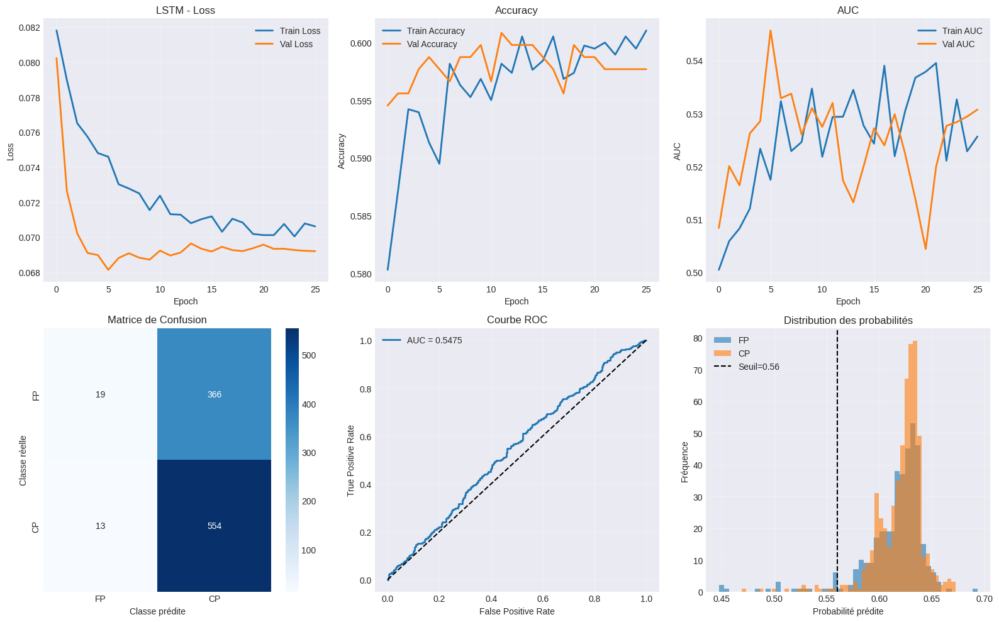
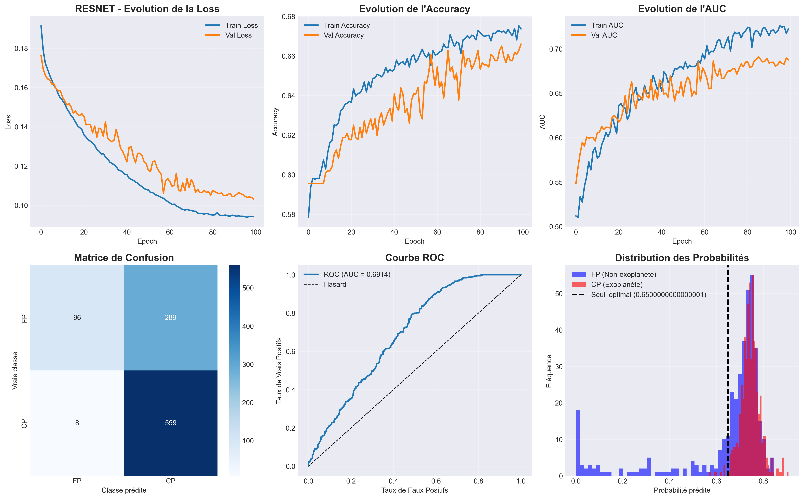
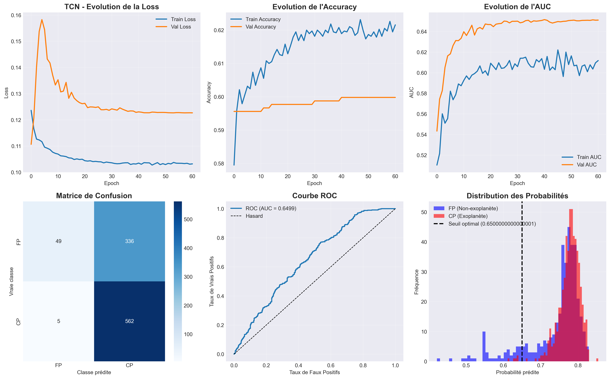
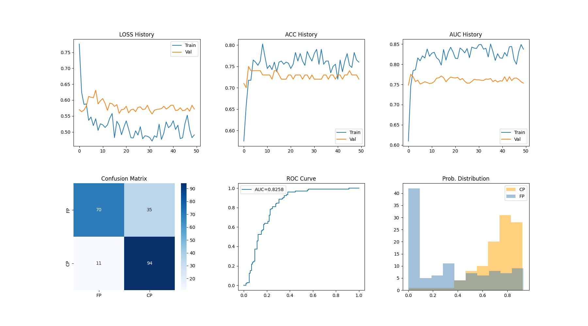
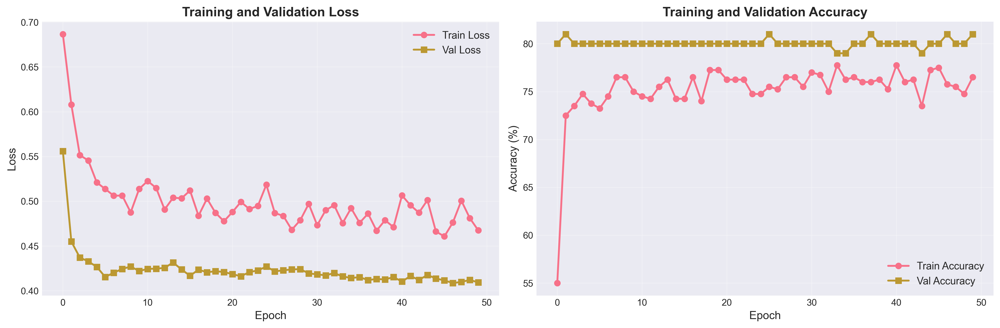
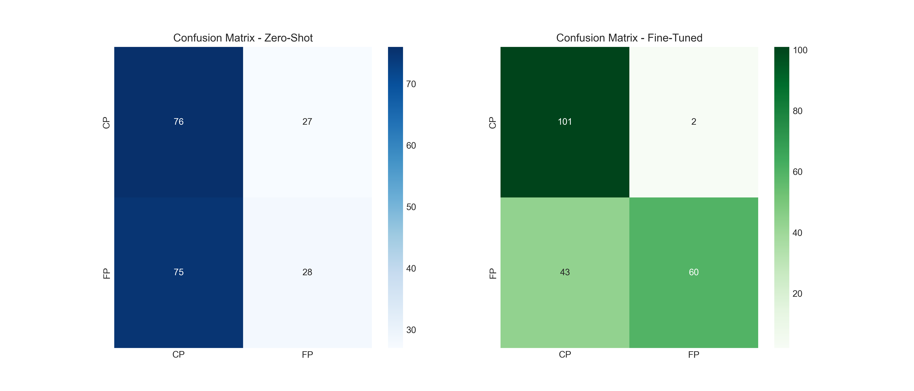
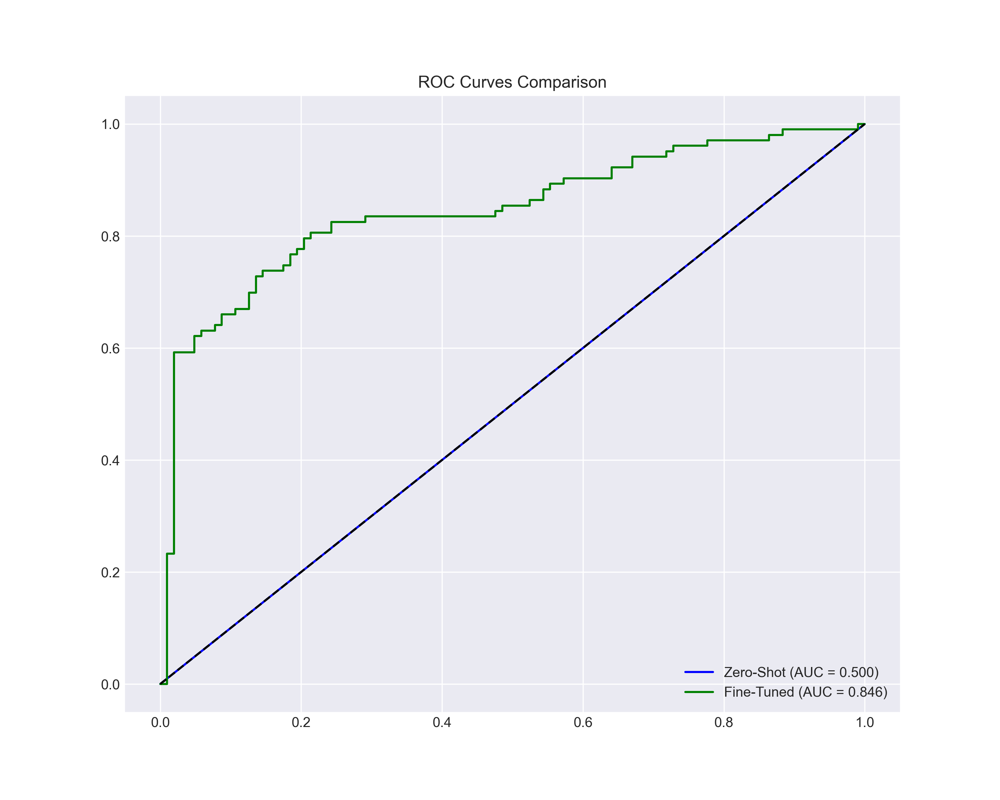
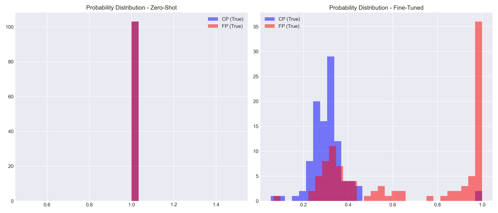

# Détection d’Exoplanètes

Projet de détection d’exoplanètes à partir de courbes de lumière au format **FITS**, en utilisant plusieurs architectures de deep learning.

## Objectif

Classifier des signaux astronomiques en :

* **CP** : Candidate Planet
* **FP** : False Positive

Les modèles travaillent sur des séries temporelles de flux.

## Modèles testés

* CNN / ResNet
* LSTM
* TCN
* Transformer
* Deep-LC

## Structure du projet

```
README.md

Fine-tuning/
    dataset.py
    deeplc.py
    resnet_finetune.py
    exofop_tess_kois.csv
    combined_7_conformal_calibrated.ckpt (à télécharger à l'adresse suivante : https://zenodo.org/records/10081600/files/combined_7_conformal_calibrated.ckpt?download=1)
From-Scratch/
    CNN.ipynb
    LSTM.ipynb
    RESNET.ipynb
    TCN.ipynb
    dataset.py
    script.py
    tri.py

Visualisation/
    cnn_exoplanet_fits_results.png
    lstm_exoplanet_fits_results.png
    resnet_exoplanet_fits_results.png
    tcn_exoplanet_fits_results.png
    deep_confusion_matrices.png
    deep_probability_distributions.png
    deep_roc_curves.png
    deep_training_curves.png
    metrics_comparison.png
    resnet_finetune.png
```

## Exemples de résultats

### CNN


### LSTM



### ResNet



### TCN



### ResNet fine-tuné



### Deep-LC







## Données

Les données doivent être au format **.fits** et organisées comme suit :

Pour Kepler :

```
dataset_fits/
 ├── CP/
 └── FP/
```

Pour TESS :

```
dataset_fits/
 ├── train/
 |      ├── CP/
 |      └── FP/
 └── test/
        ├── CP/
        └── FP/
```

## Entraînement

* Exécution prévue sur **Google Colab**
* Le modèle est sélectionné via :

```python
model_type = 'tcn'  # resnet, lstm, tcn, transformer
```

```python
python dataset.py
```

## Sorties générées

* Modèle entraîné (`.h5`) ou (`.pth`)
* Seuil optimal (`.pkl`)
* Graphiques de performance (loss, accuracy, AUC, ROC, matrice de confusion)

## Dépendances

* TensorFlow / Keras
* NumPy, Pandas
* Scikit-learn
* Astropy
* Lightkurve
* Matplotlib, Seaborn
* Deep_lc

## Note

Projet à but expérimental pour comparer différentes architectures sur des données astronomiques.